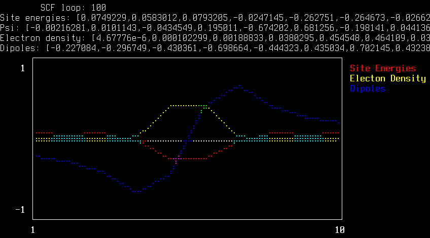

# 1D-TimeDependentPolaron

Polarons + Time-Dependent-Propagation in 1D. Some toy Julia codes.

The physical model is a one-dimension string of polarisable dipoles. 
(These are represented as an N-long array of real numbers, representing the
size and direction of the dipole moment.) 
A tight-binding Hamiltonian is built on this model, with the site energies
reconstructed from these dipoles. 
Solving this Hamiltonian to an electronic density (the lowest energy adiabatic
state, from the time independent Schrodinger equation), allows one to allow the
dipoles to respond to this electron density. 

As a function of discretised time, the electron density digs itself a hole in
this simulated dielectric of polarisable dipoles. 

The wavefunction can also be propagated by the time dependent Schrodinger
equation, and the dipoles updated to this state. 

This allows for something that is approaching surface hopping. 
A random exchange can be made to a different excited state (choice of
excited-state wavefunction from diagonalisation of the Hamiltonian).

A plot below shows the S-curve of the dipoles, generating the dimpled site energy surface (red) with the current electron density sitting in the middle of it.

And you can watch some wavepacket propagation videos with lattice response here:

## Plan
- [x] 1D dipoles for polarisation of lattice
- [x] dipoles respond to adiabatic ground states (i.e. solve TISE for H)
- [x] evolve simulation in time; (adiabatic electronic structure; step dipoles
  to respond to lattice - 'AdiabaticPropagation')
- [x] Create wavepackets + plane waves
- [ ] figure out the realistic parameters of all the values set to 1 (starting with the dt=1 !)
- [x] add time-dependent Schr. equation for propogation of the wavefunction of interest ('UnitaryPropagation')
- [ ] ? surface hopping by overlap of this wavefn. with the adiabatic solution
